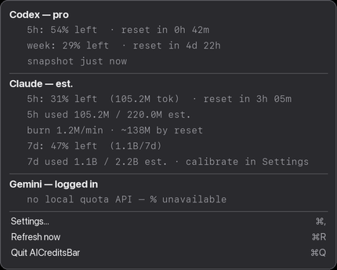
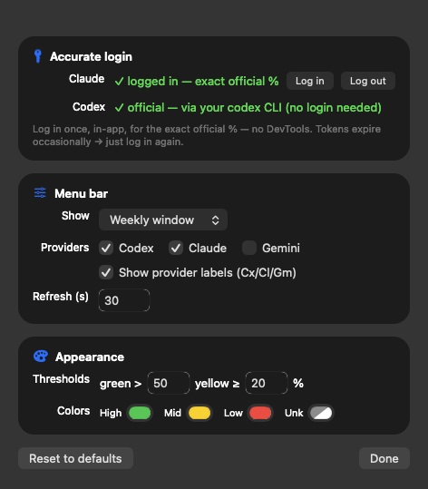

<div align="center">

# 🎛️ AICreditsBar

**Your Codex · Claude · Gemini usage limits — live in the macOS menu bar.**


**[English](#english) · [한국어](#한국어)**

</div>

---

## English

A tiny native macOS **menu-bar** widget that continuously shows how much token/quota is
left for **Codex**, **Claude**, and **Gemini** — and flags when a window has refilled.
Auto-detects which CLIs you use, refreshes every 30 s, and (by default) makes **zero network
calls** — everything is read from the local data those tools already keep on disk.

|  |  |
|---|---|
|  |  |
| **Dropdown** — full per-provider breakdown | **Settings** — Liquid-Glass, all in one place |

### ✨ Features

- **At-a-glance bar** — each provider's logo mark + remaining %, color-coded
  (🟢 > 50 · 🟡 20–50 · 🔴 < 20 · ⚪️ unknown/stale · ↑ just refilled).
- **Auto-detect** — reads `~/.codex`, `~/.claude`, `~/.gemini`; nothing to set up.
- **Exact official %** via a one-time in-app login (optional) — or a local estimate offline.
- **Fully configurable** — display mode (5h / weekly / both / lowest), per-provider toggles,
  custom colors & thresholds — in a native **Liquid Glass** settings window (macOS 26).
- **Private** — no telemetry, no credentials touched unless *you* log in; tokens stay local.

### What each provider shows

| Provider | Source | Accuracy |
|---|---|---|
| **Codex** | `~/.codex` rate-limits / ChatGPT usage API | **Exact official %** — 5-hour + weekly, with real reset times. |
| **Claude** | claude.ai usage API *(if logged in)* · else `~/.claude` transcripts | **Exact official %** when logged in; otherwise a calibratable token **estimate**. |
| **Gemini** | `~/.gemini` | Install / login status only — no local quota API. |

### Accurate login — exact official % (recommended)

By default Claude is a local **estimate**. For the **exact official %** (identical to `/usage`),
open **Settings → Accurate login → Log in** and sign in to claude.ai in the popup — the session
is captured automatically (no DevTools, no API keys). **Codex needs no extra login**: it reuses
your `codex` CLI sign-in (`~/.codex/auth.json`) automatically. Session tokens are stored locally
and are revocable (log out of claude.ai to invalidate); if a login expires the bar falls back to
the estimate and shows a notice.

### Requirements

- **macOS 11+** (Intel or Apple Silicon — you build a native binary on your own Mac).
- **Xcode Command Line Tools** (provides `swiftc`). If missing: `xcode-select --install`.

### Build & run

```bash
bash build.sh          # compiles Sources/*.swift → AICreditsBar.app
open AICreditsBar.app  # launches the menu-bar agent (no Dock icon)
```

Quit from the menu (**Quit AICreditsBar**) or `pkill -x aicreditsbar`. Print values without the GUI:

```bash
./AICreditsBar.app/Contents/MacOS/aicreditsbar --once
```

Start at login (optional): `bash scripts/install-login-item.sh` (remove with `-u`).

### Project structure

```
Sources/        Swift modules
  Config.swift        settings (UserDefaults) + color helpers
  Models.swift        WindowStat, ProviderStatus
  Support.swift       file / JSON / time helpers
  Providers.swift     Codex · Claude · Gemini readers (local + official API)
  Rendering.swift     menu-bar glyphs, colors, formatting
  WebLogin.swift      in-app WKWebView login (captures the session cookie)
  Settings.swift      Liquid-Glass settings window
  AppDelegate.swift   status item, timer, dropdown menu
  CLI.swift           --once / --dump-config / --set-* / --render-settings
  main.swift          entry point
Tests/          UnitTests + e2e (run with: bash Tests/run.sh)
scripts/        install-login-item.sh, probe.py (reference reader)
docs/           README images + render_images.py
build.sh        compile + assemble the .app bundle
```

### Development & tests

```bash
bash Tests/run.sh      # build + unit tests + end-to-end tests
```

The e2e suite runs the real binary against synthetic `~/.codex` / `~/.claude` fixtures in a
throwaway `HOME` and an isolated `UserDefaults` suite, so it never touches your real settings
or tokens.

### Privacy

AICreditsBar makes no network requests unless you opt into Accurate login. It reads only the
usage data the CLIs already write under `~/.codex`, `~/.claude`, and `~/.gemini`, computes the
numbers locally, and draws them in the menu bar. No telemetry.

### License

MIT — see [LICENSE](LICENSE).

---

## 한국어

Codex · Claude · Gemini의 남은 토큰/한도를 macOS **메뉴바**에 계속 띄워주는 작은 네이티브 위젯입니다.
한도 창이 리필되면 알려주고, 쓰는 CLI를 자동 감지하며, 30초마다 갱신합니다. 기본값은 **네트워크 호출
0** — 도구들이 디스크에 남긴 로컬 데이터만 읽습니다.

|  |  |
|---|---|
|  |  |
| **드롭다운** — 제공자별 상세 | **설정** — Liquid Glass, 한 곳에서 |

### ✨ 기능

- **한눈에** — 제공자별 로고 마크 + 남은 % (🟢 50%↑ · 🟡 20–50 · 🔴 20%↓ · ⚪️ 모름/오래됨 · ↑ 방금 리필).
- **자동 감지** — `~/.codex`, `~/.claude`, `~/.gemini`를 읽음. 설정할 것 없음.
- **정확한 공식 %** — 인앱 로그인 한 번(선택). 오프라인이면 로컬 추정치.
- **완전 커스터마이즈** — 표시 모드(5h / 주간 / 둘 다 / 최저), 제공자 토글, 색상·임계값 —
  네이티브 **Liquid Glass** 설정창(macOS 26).
- **프라이버시** — 텔레메트리 없음, 로그인 전엔 자격증명 안 건드림, 토큰은 로컬 보관.

### 각 제공자가 보여주는 것

| 제공자 | 출처 | 정확도 |
|---|---|---|
| **Codex** | `~/.codex` rate-limits / ChatGPT usage API | **정확한 공식 %** — 5시간 + 주간, 실제 리셋 시각 포함. |
| **Claude** | claude.ai usage API *(로그인 시)* · 아니면 `~/.claude` 트랜스크립트 | 로그인 시 **정확한 공식 %**, 아니면 보정 가능한 토큰 **추정치**. |
| **Gemini** | `~/.gemini` | 설치/로그인 상태만 — 로컬 한도 API 없음. |

### 정확한 로그인 — 공식값 그대로 (권장)

기본적으로 Claude는 로컬 **추정치**입니다. **공식 정확값**(`/usage`와 동일)을 원하면
**Settings → Accurate login → Log in**에서 팝업에 claude.ai 로그인을 하세요 — 세션이 자동 캡처됩니다
(DevTools·API 키 불필요). **Codex는 추가 로그인 불필요**: `codex` CLI 로그인(`~/.codex/auth.json`)을
자동 재사용합니다. 세션 토큰은 로컬에 저장되며 취소 가능(claude.ai 로그아웃 시 무효), 만료되면 추정치로
폴백하고 알림을 띄웁니다.

### 요구 사항

- **macOS 11+** (Intel 또는 Apple Silicon — 자기 맥에서 네이티브 바이너리를 직접 빌드).
- **Xcode Command Line Tools** (`swiftc`). 없으면: `xcode-select --install`.

### 빌드 & 실행

```bash
bash build.sh          # Sources/*.swift 컴파일 → AICreditsBar.app
open AICreditsBar.app  # 메뉴바 에이전트 실행 (Dock 아이콘 없음)
```

메뉴의 **Quit AICreditsBar** 또는 `pkill -x aicreditsbar`로 종료. GUI 없이 값 출력:

```bash
./AICreditsBar.app/Contents/MacOS/aicreditsbar --once
```

로그인 시 자동 시작(선택): `bash scripts/install-login-item.sh` (제거는 `-u`).

### 프로젝트 구조

```
Sources/   Swift 모듈 (Config·Models·Support·Providers·Rendering·WebLogin·Settings·AppDelegate·CLI·main)
Tests/     단위 + e2e 테스트 — 실행: bash Tests/run.sh
scripts/   install-login-item.sh, probe.py (참조 리더)
docs/      README 이미지 + render_images.py
build.sh   컴파일 + .app 번들 조립
```

### 개발 & 테스트

```bash
bash Tests/run.sh      # 빌드 + 단위 테스트 + e2e 테스트
```

e2e는 실제 바이너리를 **가짜 HOME + 격리된 UserDefaults**에서 합성 픽스처로 돌리므로, 당신의 실제
설정/토큰을 절대 건드리지 않습니다.

### 프라이버시

Accurate login을 켜지 않는 한 네트워크 요청을 하지 않습니다. CLI들이 이미 `~/.codex`, `~/.claude`,
`~/.gemini`에 남긴 사용량 데이터만 읽어 로컬에서 계산해 메뉴바에 그립니다. 텔레메트리 없음.

### 라이선스

MIT — [LICENSE](LICENSE) 참고.
