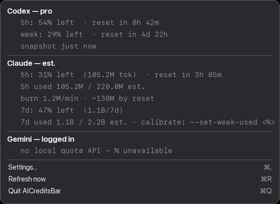
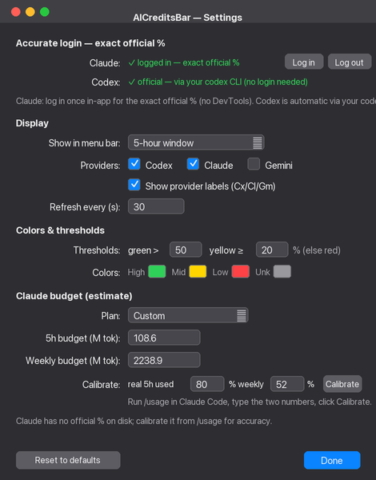

<div align="center">

# 🎛️ AICreditsBar

**Your Codex · Claude · Gemini usage limits — live in the macOS menu bar.**


**[English](#english) · [한국어](#한국어)**

</div>

---

## English

A tiny native macOS **menu-bar** widget that continuously shows how much token/quota is
left for **Codex** and **Claude**, plus **Gemini** connection status.
Checks run automatically every 15 s by default, even with the menu closed. Each provider
updates independently; online successes are cached for 30 s and failures retry with
exponential backoff (30–240 s). Existing custom check intervals are preserved.
Codex automatically reuses an existing CLI login for online usage; Claude uses online
usage when an in-app login is saved. Otherwise, readings come from local CLI files.

|  |  |
|---|---|
|  |  |
| **Dropdown** — full per-provider breakdown | **Settings** — Liquid-Glass, all in one place |

### ✨ Features

- **At-a-glance bar** — native terminal / sun / sparkle symbols + remaining %, color-coded
  (green > 50 · yellow 20–50 · red < 20 · gray unknown/stale). `~` means estimate;
  a trailing dot means at least one window is stale. Gemini shows connection status.
- **Live fuel gauges** — 5-hour and weekly remaining bars, reset countdowns, source labels,
  and freshness. The next known reset is summarized below the cards. Hover a card for full details.
- **Always checking** — wake resumes checks; open menus update without losing keyboard
  focus. Slow providers do not block others, and duplicate refresh requests do not pile up.
- **Honest reset handling** — a passed reset time is marked stale until refreshed, never
  silently converted into 100% quota. Manual refresh bypasses the online cache and backoff.
- **Auto-detect** — reads `~/.codex`, `~/.claude`, `~/.gemini`; nothing to set up.
- **Exact official %** via a one-time in-app login (optional) — or a local estimate offline.
- **Fully configurable** — display mode (5h / weekly / both / lowest), per-provider toggles,
  custom colors & thresholds — in a native **Liquid Glass** settings window (macOS 26).
- **Private** — no telemetry, no credentials touched unless *you* log in; tokens stay local.

### What each provider shows

| Provider | Source | Accuracy |
|---|---|---|
| **Codex** | `~/.codex` rate-limits / ChatGPT usage API | **Exact official %** — 5-hour + weekly, with real reset times. |
| **Claude** | claude.ai usage API *(if logged in)* · else `~/.claude` transcripts | **Exact official %** when logged in; otherwise a calibratable token **estimate**. |
| **Gemini** | `~/.gemini` | Install / login status only — no local quota API. |

### Accurate login — exact official % (recommended)

By default Claude is a local **estimate**. For the **exact official %** (identical to `/usage`),
open **Settings → Accurate login → Log in** and sign in to claude.ai in the popup — the session
is captured automatically (no DevTools, no API keys). **Codex needs no extra login**: it reuses
your `codex` CLI sign-in (`~/.codex/auth.json`) automatically. Session tokens are stored locally
and are revocable (log out of claude.ai to invalidate); if a login expires the bar falls back to
the estimate and shows a notice.

### Requirements

- **macOS 11+** (Intel or Apple Silicon — you build a native binary on your own Mac).
- **Xcode Command Line Tools** (provides `swiftc`). If missing: `xcode-select --install`.

### Build & run

```bash
bash build.sh          # compiles Sources/*.swift → AICreditsBar.app
open AICreditsBar.app  # launches the menu-bar agent (no Dock icon)
```

Quit from the menu (**Quit AICreditsBar**) or `pkill -x aicreditsbar`. Print values without the GUI:

```bash
./AICreditsBar.app/Contents/MacOS/aicreditsbar --once
```

Start at login (optional): `bash scripts/install-login-item.sh` (remove with `-u`).

### Command-line flags

All flags run headless (no GUI) against `aicreditsbar` in the app bundle:

```bash
B=./AICreditsBar.app/Contents/MacOS/aicreditsbar

$B --once                    # print all providers' status once, then exit
$B --dump-config             # print effective settings (then prints --once output)

# Calibrate the Claude *estimate* to match what /usage actually shows.
# Open Claude's /usage, read the "used" %, and pass it here — the budget is
# back-solved from your real 7-day / current-5h-block token totals on disk.
$B --set-week-used 35        # "weekly shows 35% used" → calibrates the 7-day budget
$B --set-5h-used 60          # "5h block shows 60% used" → calibrates the 5-hour budget

# Official exact-% logins (alternative to the in-app Settings → Log in flow):
$B --set-claude-key <key>    # store a claude.ai sessionKey cookie
$B --set-codex-token <tok>   # store a chatgpt.com session-token (Codex usually needs none)
$B --clear-logins            # drop both official tokens; revert to local estimate/disk

$B --render-settings out.png # render the Settings window to a PNG (design check)
$B --render-preview out.png  # native usage cards with explicitly labeled SAMPLE values
```

> Calibration and the budget used for the Claude estimate live behind these CLI flags —
> there is no plan/budget control in the Settings window (which covers display mode,
> providers, thresholds, colors, and accurate login only).

### Project structure

```
Sources/        Swift modules
  Config.swift        settings (UserDefaults) + color helpers
  Models.swift        WindowStat, ProviderStatus
  Support.swift       file / JSON / time helpers
  Providers.swift     Codex · Claude · Gemini readers (local + official API)
  Rendering.swift     menu-bar glyphs, colors, formatting
  WebLogin.swift      in-app WKWebView login (captures the session cookie)
  Settings.swift      Liquid-Glass settings window
  AppDelegate.swift   status item, timer, dropdown menu
  RefreshController.swift  independent provider workers + automatic checks
  ProviderCardView.swift    native fuel gauges + next reset summary
  Preview.swift       render actual native cards with sample data for QA
  CLI.swift           --once / --dump-config / --set-* / --render-settings
  main.swift          entry point
Tests/          UnitTests + e2e (run with: bash Tests/run.sh)
scripts/        install-login-item.sh, probe.py (reference reader)
docs/           README images + render_images.py
build.sh        compile + assemble the .app bundle
```

### Development & tests

```bash
bash Tests/run.sh      # build + unit tests + end-to-end tests
```

The e2e suite runs the real binary against synthetic `~/.codex` / `~/.claude` fixtures in a
throwaway `HOME` and an isolated `UserDefaults` suite, so it never touches your real settings
or tokens.

### Privacy

AICreditsBar reads local usage under `~/.codex`, `~/.claude`, and `~/.gemini`.
When a Codex CLI login or saved in-app login is present, it also contacts that provider's
usage endpoint using the existing credentials. No telemetry. A saved credential is not
proof of a working login: check the menu's source and failure notice for the live result.

### License

MIT — see [LICENSE](LICENSE).

---

## 한국어

Codex · Claude · Gemini의 남은 토큰/한도를 macOS **메뉴바**에 계속 띄워주는 작은 네이티브 위젯입니다.
쓰는 CLI를 자동 감지하며, 메뉴가 닫혀 있어도 기본 15초마다 독립적으로 확인합니다.
공식 조회 성공값은 30초간 캐시하고, 실패 시 30~240초 간격으로 자동 재시도합니다.
기존에 설정한 갱신 간격은 유지됩니다. Codex CLI 로그인 또는 저장된 인앱 로그인이 있으면
해당 서비스의 온라인 사용량도 조회합니다. Gemini는 연결 상태만 표시합니다.

|  |  |
|---|---|
|  |  |
| **드롭다운** — 제공자별 상세 | **설정** — Liquid Glass, 한 곳에서 |

### ✨ 기능

- **한눈에** — 터미널·태양·반짝임 아이콘과 남은 %. `~`는 추정값, 뒤의 점은 오래된 창이 있음을 뜻합니다.
- **잔량 게이지** — 5시간·주간 잔량 막대, 리셋까지 남은 시간, 공식/로컬/추정 출처, 마지막 데이터 시각.
- **자동 갱신** — 잠자기 복귀 시 다시 확인하고, 한 서비스가 느려도 다른 서비스는 갱신됩니다.
- **리셋 확인** — 예정 시간이 지났다고 100%로 바꾸지 않습니다. 새 값을 받을 때까지 오래된 값으로 표시합니다.
- **자동 감지** — `~/.codex`, `~/.claude`, `~/.gemini`를 읽음. 설정할 것 없음.
- **정확한 공식 %** — 인앱 로그인 한 번(선택). 오프라인이면 로컬 추정치.
- **완전 커스터마이즈** — 표시 모드(5h / 주간 / 둘 다 / 최저), 제공자 토글, 색상·임계값 —
  네이티브 **Liquid Glass** 설정창(macOS 26).
- **프라이버시** — 텔레메트리 없음. 기존 Codex CLI 로그인 또는 저장된 인앱 로그인으로 사용량을 조회하며 토큰은 로컬 보관.

### 각 제공자가 보여주는 것

| 제공자 | 출처 | 정확도 |
|---|---|---|
| **Codex** | `~/.codex` rate-limits / ChatGPT usage API | **정확한 공식 %** — 5시간 + 주간, 실제 리셋 시각 포함. |
| **Claude** | claude.ai usage API *(로그인 시)* · 아니면 `~/.claude` 트랜스크립트 | 로그인 시 **정확한 공식 %**, 아니면 보정 가능한 토큰 **추정치**. |
| **Gemini** | `~/.gemini` | 설치/로그인 상태만 — 로컬 한도 API 없음. |

### 정확한 로그인 — 공식값 그대로 (권장)

기본적으로 Claude는 로컬 **추정치**입니다. **공식 정확값**(`/usage`와 동일)을 원하면
**Settings → Accurate login → Log in**에서 팝업에 claude.ai 로그인을 하세요 — 세션이 자동 캡처됩니다
(DevTools·API 키 불필요). **Codex는 추가 로그인 불필요**: `codex` CLI 로그인(`~/.codex/auth.json`)을
자동 재사용합니다. 세션 토큰은 로컬에 저장되며 취소 가능(claude.ai 로그아웃 시 무효), 만료되면 추정치로
폴백하고 알림을 띄웁니다.

### 요구 사항

- **macOS 11+** (Intel 또는 Apple Silicon — 자기 맥에서 네이티브 바이너리를 직접 빌드).
- **Xcode Command Line Tools** (`swiftc`). 없으면: `xcode-select --install`.

### 빌드 & 실행

```bash
bash build.sh          # Sources/*.swift 컴파일 → AICreditsBar.app
open AICreditsBar.app  # 메뉴바 에이전트 실행 (Dock 아이콘 없음)
```

메뉴의 **Quit AICreditsBar** 또는 `pkill -x aicreditsbar`로 종료. GUI 없이 값 출력:

```bash
./AICreditsBar.app/Contents/MacOS/aicreditsbar --once
```

로그인 시 자동 시작(선택): `bash scripts/install-login-item.sh` (제거는 `-u`).

### 커맨드라인 플래그

모든 플래그는 GUI 없이 앱 번들의 `aicreditsbar`를 실행합니다:

```bash
B=./AICreditsBar.app/Contents/MacOS/aicreditsbar

$B --once                    # 모든 제공자 상태를 한 번 출력 후 종료
$B --dump-config             # 적용된 설정 출력 (이어서 --once 출력)

# Claude *추정치*를 /usage 실제 표시값에 맞춰 보정.
# Claude의 /usage에서 "used" %를 읽어 넘기면, 디스크의 실제 7일 / 현재 5h 블록
# 토큰 합계로부터 예산을 역산합니다.
$B --set-week-used 35        # "주간 35% 사용" → 7일 예산 보정
$B --set-5h-used 60          # "5h 블록 60% 사용" → 5시간 예산 보정

# 공식 정확값 로그인 (인앱 Settings → Log in 대신 사용 가능):
$B --set-claude-key <key>    # claude.ai sessionKey 쿠키 저장
$B --set-codex-token <tok>   # chatgpt.com session-token 저장 (Codex는 보통 불필요)
$B --clear-logins            # 두 공식 토큰 삭제; 로컬 추정치/디스크로 복귀

$B --render-settings out.png # Settings 창을 PNG로 렌더 (디자인 확인)
```

> 보정과 Claude 추정치 예산은 위 CLI 플래그로만 설정합니다 — 설정 창에는 플랜/예산
> 컨트롤이 없습니다(설정 창은 표시 모드·제공자·임계값·색상·정확 로그인만 다룸).

### 프로젝트 구조

```
Sources/   Swift 모듈 (Config·Models·Support·Providers·Rendering·WebLogin·Settings·AppDelegate·CLI·main)
Tests/     단위 + e2e 테스트 — 실행: bash Tests/run.sh
scripts/   install-login-item.sh, probe.py (참조 리더)
docs/      README 이미지 + render_images.py
build.sh   컴파일 + .app 번들 조립
```

### 개발 & 테스트

```bash
bash Tests/run.sh      # 빌드 + 단위 테스트 + e2e 테스트
```

e2e는 실제 바이너리를 **가짜 HOME + 격리된 UserDefaults**에서 합성 픽스처로 돌리므로, 당신의 실제
설정/토큰을 절대 건드리지 않습니다.

### 프라이버시

`~/.codex`, `~/.claude`, `~/.gemini`의 로컬 사용량을 읽습니다. Codex CLI 로그인이나 저장된
인앱 로그인이 있으면 해당 서비스의 사용량 API에도 요청합니다. 텔레메트리는 없습니다.
설정의 로그인 저장 표시는 인증 성공을 보장하지 않으며, 실제 결과는 메뉴의 출처·오류 표시로 확인합니다.

### 라이선스

MIT — [LICENSE](LICENSE) 참고.
